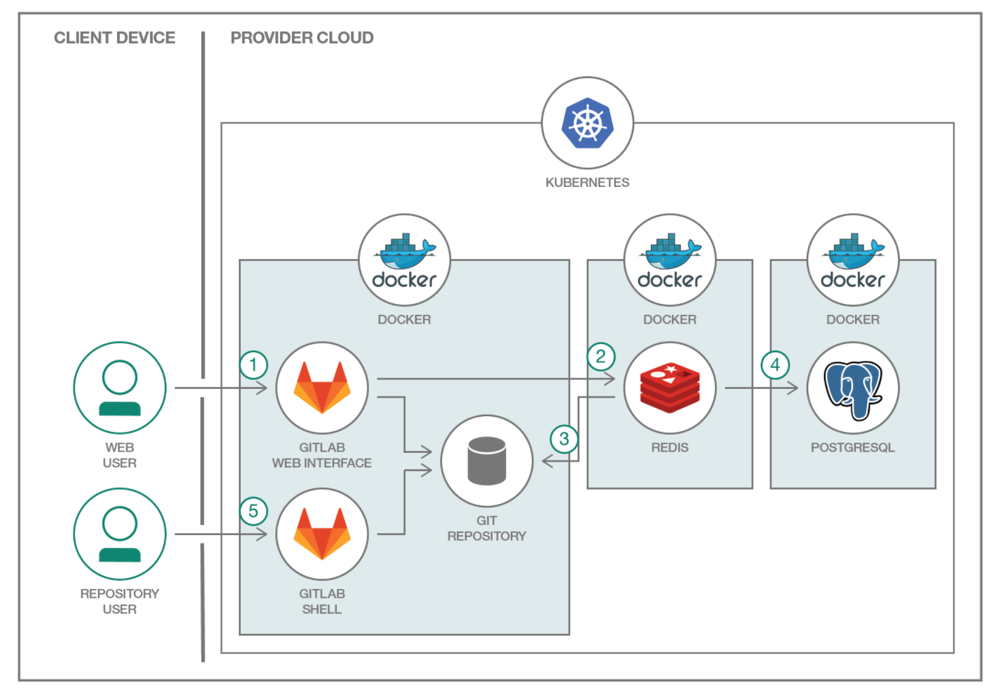
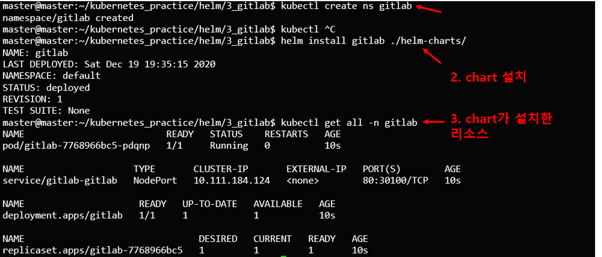

# 개요
* helm gitlab 설치
* gitlab 구조

<br>



<br>

# 실행방법
1. namespace 생성(기본: gitlab)
```
kubectl create ns gitlab
```
> gitlab이 아닌 namespace를 사용할 경우 values.yaml에서 namespace수정
2. chart 설치
```
helm install gitlab ./helm-charts
```

<br>



<br> 설치결과


# 참고자료
* [1] 블로그: https://zunoxi.github.io/devops/2020/07/19/devops-k8s-Gitlab/
* [2] gitlab-ce 도커 공식이미지: https://hub.docker.com/r/gitlab/gitlab-ce
* [3] 블로그: https://blog.lwolf.org/post/fully-automated-gitlab-installation-on-kubernetes-including-runner-and-registry/
* [4] gitlab 커스텀 github: https://github.com/lwolf/gitlab-chart.git
* [5] gitlab helm 공식문서: https://gitlab.com/charts/charts.gitlab.io