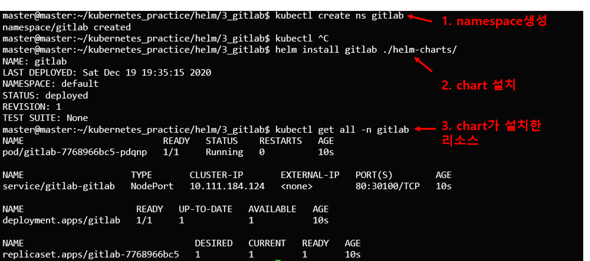

# 1. 개요
* helm gitlab 설치
* gitlab 구조

<br>


아키텍처

<br>

# 2. 실행방법
1. namespace 생성(기본: gitlab)
```
kubectl create ns gitlab
```
> gitlab이 아닌 namespace를 사용할 경우 values.yaml에서 namespace수정
2. chart 설치
```
helm install gitlab ./helm-charts
```
3. external_url 설정
* nfs/gitlab/config/gitlab.rb 32번째 줄 수정
```
external_url 'http://gitlab-gitlab.gitlab.svc'
```
* gitlab 터널 접속 후 변경된 gitlab.rb설정 적용
```sh
kubectl exec --stdin --tty [pod 이름] -- /bin/bash
gitlab-ctl reconfigure
```

<br>


설치결과

<br>

# 3. todo list
* [ ] gitlab-cli
* [ ] gitlab-runner
* [ ] redis 연동
* [ ] postgresql 연동
* [ ] argocd 연동
* [ ] https
* [x] external_url

<br>

# 4. 참고자료
* [1] 블로그: https://zunoxi.github.io/devops/2020/07/19/devops-k8s-Gitlab/
* [2] gitlab-ce 도커 공식이미지: https://hub.docker.com/r/gitlab/gitlab-ce
* [3] 블로그: https://blog.lwolf.org/post/fully-automated-gitlab-installation-on-kubernetes-including-runner-and-registry/
* [4] gitlab 커스텀 github: https://github.com/lwolf/gitlab-chart.git
* [5] gitlab helm 공식문서: https://gitlab.com/charts/charts.gitlab.io
* [6] 블로그-gitlabrb mount: https://www.ylcnky.com/blogs/dev-ops-infrastructure-with-k3s-and-gitlab-a-simple-yet-powerful-pair
* [7] 공식문서-gitlab external_url 설명: https://docs.gitlab.com/omnibus/settings/configuration.html