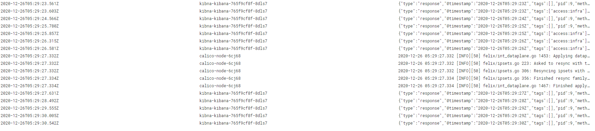
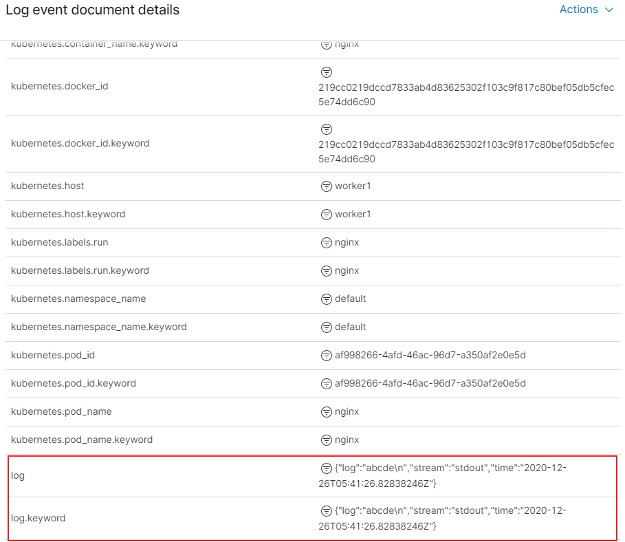
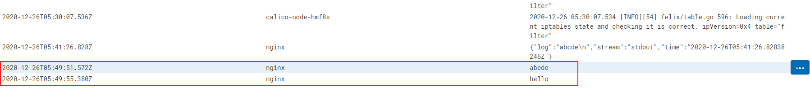
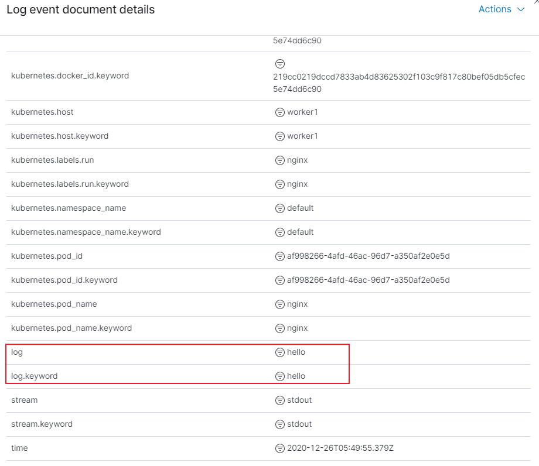

# 1. 개요 
* fluent-bit 테스트 일지

<br>

# 2. 쿠버네티스 필터
* Merge_log: 
  * json to string으로 추측
  * default: Off
  * 공식설명: When enabled, it checks if the log field content is a JSON string map, if so, it append the map fields as part of the log structure. 

<br>

# 3. fluent-bit 설정1
## 3.1 모든로그 출력
1. 설정
```yaml
filters: |
    [FILTER]
        Name                kubernetes
        Match               kube.*
        Kube_URL            https://kubernetes.default.svc:443
        Kube_CA_File        /var/run/secrets/kubernetes.io/serviceaccount/ca.crt
        Kube_Token_File     /var/run/secrets/kubernetes.io/serviceaccount/token
        Kube_Tag_Prefix     kube.var.log.containers.
        Merge_Log           On

  ## https://docs.fluentbit.io/manual/pipeline/outputs
  outputs: |
    [OUTPUT]
        Name            es
        Match           *
        Host            elasticsearch-master
        Port            9200
        HTTP_User elastic
        HTTP_Passwd changeme
        Logstash_Format On
        Replace_Dots    On
        Retry_Limit     False
        Buffer_Size     False
```
2. 결과
* 모든 로그 출력



<br>

## 3.2 grep
1. 설정: hello, world, abcde만 출력
  * 단점: fluent-bit에 부하 발생
```yaml
  filters: |
    [FILTER]
        Name                kubernetes
        Match               kube.*
        Kube_URL            https://kubernetes.default.svc:443
        Kube_CA_File        /var/run/secrets/kubernetes.io/serviceaccount/ca.crt
        Kube_Token_File     /var/run/secrets/kubernetes.io/serviceaccount/token
        Kube_Tag_Prefix     kube.var.log.containers.
        K8S-Logging.Parser  On
        K8S-Logging.Exclude On
        Merge_Log           Off

    [FILTER]
        Name              grep
        Match             kube.*
        Regex             log (hello|world|abcde)

  ## https://docs.fluentbit.io/manual/pipeline/outputs
  outputs: |
    [OUTPUT]
        Name            es
        Match           *
        Host            elasticsearch-master
        Port            9200
        HTTP_User elastic
        HTTP_Passwd changeme
        Logstash_Format On
        Replace_Dots    On
        Retry_Limit     False
        Buffer_Size     False
```

2. 결과



<br>

## 3.3 grep to string
1. 설정
```yaml
  filters: |
    [FILTER]
        Name                kubernetes
        Match               kube.*
        Kube_URL            https://kubernetes.default.svc:443
        Kube_CA_File        /var/run/secrets/kubernetes.io/serviceaccount/ca.crt
        Kube_Token_File     /var/run/secrets/kubernetes.io/serviceaccount/token
        Kube_Tag_Prefix     kube.var.log.containers.
        K8S-Logging.Parser  On
        K8S-Logging.Exclude On
        Merge_Log           On

    [FILTER]
        Name              grep
        Match             kube.*
        Regex             log (hello|world|abcde)

  ## https://docs.fluentbit.io/manual/pipeline/outputs
  outputs: |
    [OUTPUT]
        Name            es
        Match           *
        Host            elasticsearch-master
        Port            9200
        HTTP_User elastic
        HTTP_Passwd changeme
        Logstash_Format On
        Replace_Dots    On
        Retry_Limit     False
        Buffer_Size     False
```

2. 결과



<br>



<br>

# 참고자료
* [1] 공식문서-kubernetes 필터: https://docs.fluentbit.io/manual/pipeline/filters/kubernetes